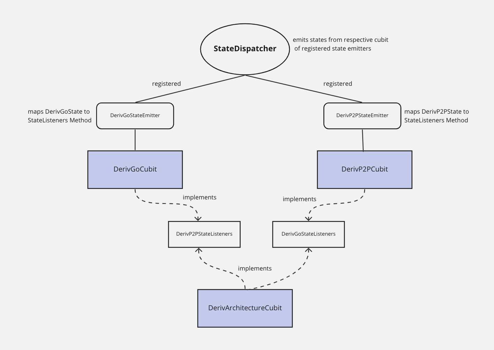

# bloc_manager_simple

Implementation of `bloc_manager` to show reaction to state changes from `bloc` while being **decoupled** to it. In this implementation, we have our own mobile sub teams reacting to the task doing state of other teams with some funny gifs. Except for mobile archotecture team, no team reacts to architecture team but it reacts to all other teams.

Flow: When **P2P team** is doing some tasks, **Architecture and GO team** reacts to it with some funny gifs. When **GO team** is doing some tasks, **Architecture team** and** GO team** reacts to it with some funny gifs.

### Architectural Representation of the Cubits

